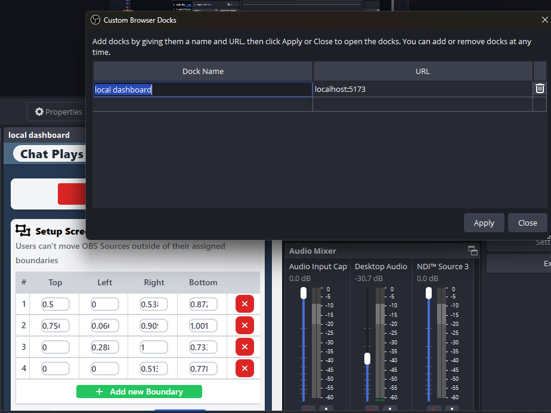

# Chat Plays OBS
Twitch Hackathon project for https://twitchstreamertools.devpost.com/

## How to use
- Step 1: Add the [Extension](https://dashboard.twitch.tv/extensions/k82fkk45cyr54fkinpozggfporx191-0.0.1) to your twitch account
- Step 2 
  - add one of the below options to your obs custom docks
  - 

    
Option 1: Hosted

    <ul>
        <li>
            <a href="https://chronx.dev/chat-plays-obs/embed.html" target="_blank">https://stg.chronx.dev/chat-plays-obs/index.html#/</a>
        </li>
        <li>
            
        </li>
        <li>
            Add that dock to your OBS view.
        </li>
    </ul>

    
Option 2: Local

    <ul>
        <li>Clone this project.</li>
        <li>Go to the <code>streamerAppOBS</code> folder.</li>
        <li>Open terminal.</li>
        <li><code>npm install</code></li>
        <li><code>npm run dev</code></li>
        <li>Add <code>localhost:5173</code> as the URL for the custom dock.</li>
        <li>
            
        </li>
        <li>
            Add that dock to your OBS view.
        </li>
    </ul>

    

## Results

## How It Works
- **Click Data Processing:** 
  - Users interact via clicks in the frontend.
  - Clicks are processed and translated into commands to move OBS sources.
- **OBS WebSockets:**
  - Local WebSocket controls modify OBS sources in real-time.
  - Sources can be repositioned or adjusted dynamically based on input.
- **Room Creation:**
  - Uses a Rust-based WebSocket backend to create and manage rooms.
  - Supports multiple concurrent streams with separate configurations.
  
### Graph of the system

Graph provided by vivax3794
