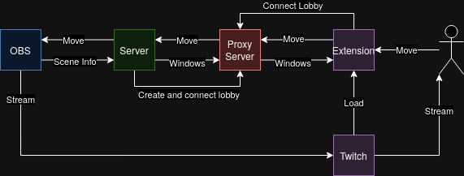

# Chat Plays OBS
Twitch Hackathon project for https://twitchstreamertools.devpost.com/

## How to use
- clone the project
- go to the streamerAppConfig folder
  - go to release
  - extract the proper one for windows or mac
    - extract to the streamerApp folder
    - or move the extracted app to the streamerApp folder
- go to the streamerApp folder
  - run `pip install -r requirements.txt`
  - run `python main.py`
    - if you dont have python installed you can get it from the [microsoft store](https://apps.microsoft.com/detail/9nrwmjp3717k?hl=en-US&gl=US)

## How It Works
- **Click Data Processing:** 
  - Users interact via clicks in the frontend.
  - Clicks are processed and translated into commands to move OBS sources.
- **OBS WebSockets:**
  - Local WebSocket controls modify OBS sources in real-time.
  - Sources can be repositioned or adjusted dynamically based on input.
- **Room Creation:**
  - Uses a Rust-based WebSocket backend to create and manage rooms.
  - Supports multiple concurrent streams with separate configurations.
  
### Graph of the system

provided by vivax3794